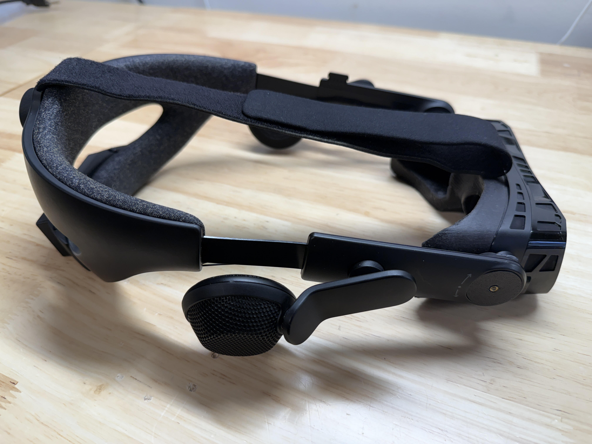

# Project Beyondex
Project Beyondex © 2025 by Fluid Immersive, Inc is licensed under CC BY-NC-SA 4.0.

## What is Project Beyondex?
Many of us upgrading from the Valve Index to the Bigscreen Beyond love the size and comfort, but find ourselves missing the incredible off-ear soundscape from the Index. 

That got us thinking. What if we could have both?

Project Beyondex is a mod we have designed for the Valve Index audio strap which makes its integrated audio compatible with the Bigscreen Beyond.

The mod involves removing the audio strap from the Index and flipping it "upside down", which allows the portion of the strap which cradled the back of the head to instead provide top-support for enhanced comfort. This kit is SUPER comfortable and packs both great sound and great visuals thanks to the micro-OLED screens and pancake optics of the Beyond. It's our favorite way to experience PCVR that we have experienced so far in our careers as VR devs.

We started from the original Firmware and DAC/AMP design of [Sctanf's Pico Amp project](https://github.com/sctanf/picoamp-2) and added a power supplementation system that allows us to drive the BMR drivers of the Index audio strap at full HD quality and volume from the output of the Beyond's usb port. Then we designed custom 3D model files for the connectors, enclosure, and top strap D-ring which when installed on the Index audio strap and Beyond, turn it into something that feels like it is a fully-integrated whole and more than just a modded headset. 

## How to Make a Your Beyondex

If you don't have a 3D printer, you can get a Project Beyondex Mod Kit with everything you need included in the box. We also sell an all-in-one version that we hand-build for you. To get any of these, head over to the [Fluid VR Headset Mod Store](https://shop.fluid.so).

The 3D model files are hosted [here](https://github.com/FluidXR/project-beyondex/tree/main/3d_models). We print ours on Bambu Labs H2D printers with standard settings and no supports in black Bambu Labs PLA Basic. Other filaments, especially matte PLA are too brittle and we recommend going with normal PLA or other non-brittle materials. 

Print the connectors facing "up" with the small flat cut into the side contacting the build plate. Mirror one of them along the model's Y axis so that the holes for the pogo pins are on the other side. Print the enclosure with the flat side down, and make sure that the D-ring also has its flat side down. 

After everything is printed, figure out which side is which for the connectors and then put the corresponding pogo pins though the holes so the pins just stick out a few millimeters. The negative leads go in the holes farthest from the flat. You'll find the R and L +/- labels printed on the PCB next to the connector to determine which leads go to which side. 

Finally, add the m2.5 heat-set insert into the hole in the washer using a soldering iron. At this point, your kit is the same as the one shown in the installation video. 

The D-ring is attached to the Beyond by removing the top two m2 self-tapping screws (t6 head) and replacing with two 6mm m2 self-tapping (blunt point) screws. 

**Installation instruction video**: https://www.youtube.com/watch?v=sTAcx7Pnb1I

**Note:** We spent a lot of time and money developing the 3D models, PCBs, and other designs in this project. You are free to use these models for yourself, but you may not use them commercially or sell prints of these online. If you remix, repost, or modify these files or models, you must do so under the same non-commercial license in this repo and point back to this repo and license. If you want to make your own Beyondex-like project under a different licencse for commercial use, you can start from Sctanf's project's files, which have licenses that are more permissive.

Sctanf's Pico Amp PCB schematics and firmware are licensed under MIT license (firmware) and CERN OHL v2 license (hardware). The connector brackets incorporate portions of the Bigscreen [Beyond Strap Connector](https://www.printables.com/model/1049308-bigscreen-beyond-audio-strap-official-cad-data) under a Creative Commons (Attribution) license.
